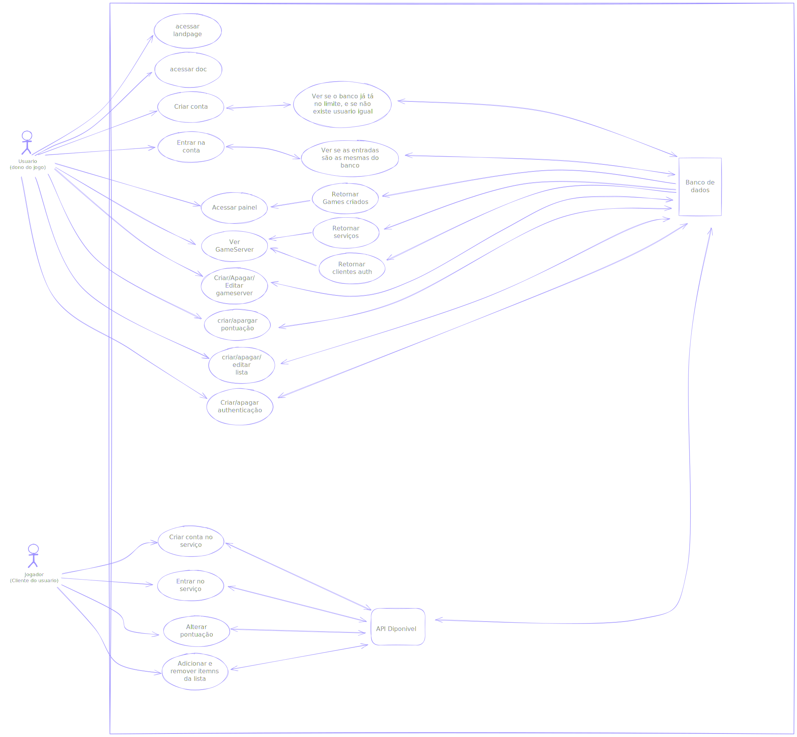
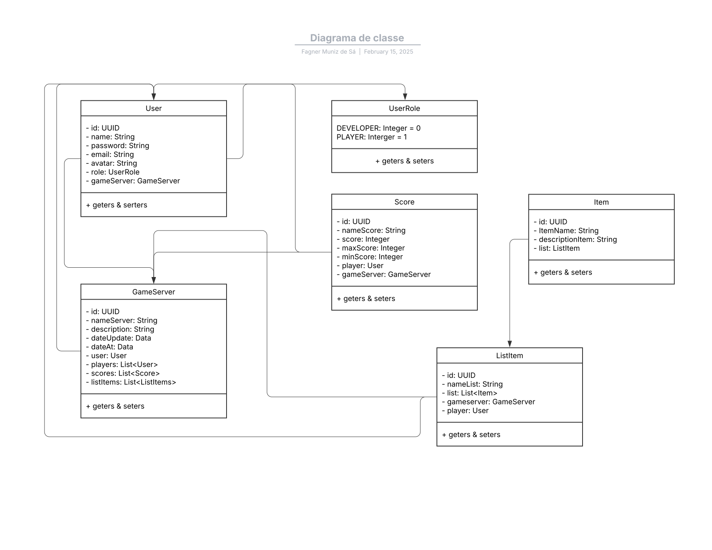

<div align="center">

</div>

O **GuimScore** é um sistema desenvolvido para armazenar e gerenciar dados de jogos online, como pontuações, itens adquiridos, progresso e outras informações relevantes. O objetivo principal é fornecer uma solução eficiente para jogadores e desenvolvedores que desejam manter um histórico organizado de suas atividades em jogos online.

## Funcionalidades

- **Armazenamento de Pontuações**: Registro e consulta de pontuações alcançadas em diferentes jogos.
- **Gerenciamento de Itens**: Controle de itens adquiridos ou coletados durante as partidas.
- **Progresso do Jogador**: Acompanhamento do progresso do jogador em diversos jogos.
- **Interface Amigável**: Fácil de usar e integrar com outros sistemas.
- **Segurança**: Proteção dos dados dos usuários com práticas de segurança modernas.

## Tecnologias Utilizadas

- **FrontEnd**:
- - Next
- - TypeScript
- - Redis Ui
- - Axis
- **Backend**:
- - Java
- - Spring Framework
- - - Spring Data
- - - Spring Security
- **Banco de Dados**:
- - MongoDB:4.4

## Como Usar

### Pré-requisitos

- Ter o docker instalado na sua maquina

### Instalação

```
docker-compose up -d
```

### Caso de uso



### Diagrama de classe

